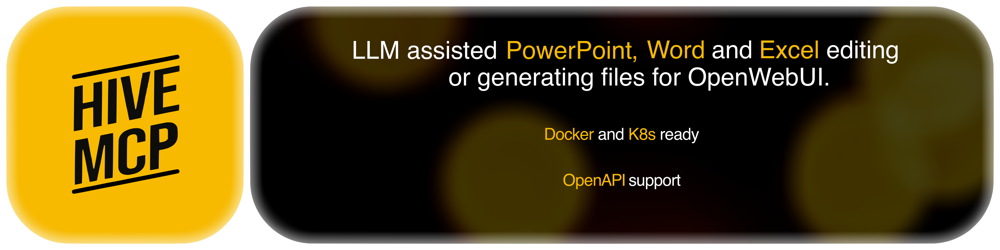

<h1 align="center">HiveMCP</h1>

<p align="center">
  
</p>

<p align="center"><strong>1.0.6</strong></p>

---

Generates and edits PowerPoint, Word, Excel and Markdown files for [OpenWebUI](https://openwebui.com).
Runs as a container, exposed both as an **MCP Streamable HTTP** server and as an
**OpenAPI tool server** from the same FastAPI app.

Why both: OpenWebUI renders inline iframes only for tool results carrying
`Content-Disposition: inline`, and that path exists for OpenAPI tool servers but not for
the native MCP surface. MCP gives protocol compatibility, OpenAPI gives the configuration
GUI.

## What it does

| Tool | Who can use it |
|---|---|
| `hive_create_presentation` · `hive_create_document` · `hive_create_spreadsheet` | everyone |
| `hive_create_markdown` — README, release notes, static-site posts | everyone |
| `hive_read_document` · `hive_edit_document` — patch a file from the chat | everyone |
| `hive_show_download` — download card with a real button | everyone |
| `hive_list_templates` · `hive_inspect_template` | everyone |
| `hive_upload_template` · `hive_delete_template` | administrators |
| `hive_open_config` — settings card rendered inline in the chat | everyone |
| `hive_usage_guide` — the bundled skill, the one tool that needs no session | everyone |

Markdown takes the *same* `DocSpec` as Word. The block types already describe a document,
so a second spec would only be a second thing for a model to learn and for this repository
to keep in step.

How finished files reach the user is a setting, `HIVE_DELIVERY_MODE`: uploaded to the
caller's own OpenWebUI files, handed over as a signed link from this server, or both
(the default, and the only mode where a failed upload still yields the document).

## Status

| Milestone | Scope | State |
|---|---|---|
| M0 | Integration spikes: session auth, file ownership, Rich UI | **done** |
| M1 | Skeleton: config, auth, health, download, Dockerfile | **done** |
| M2 | Render core: pptx / docx / xlsx from a spec | **done** |
| M3 | MCP + OpenAPI surfaces, OpenWebUI file delivery | **done** |
| M4 | Templates: admin-curated pool, upload, inspect | **done** |
| M5 | Configuration GUI as an iframe | **done** |
| M6 | Editing files uploaded to the chat | **done** |
| M7 | Skill, K8s manifests, hardening | **done** |

Since M7: configurable delivery, Markdown as a fourth format, and cards that follow
OpenWebUI's theme live.

## Quick start

```bash
uv venv && source .venv/bin/activate
uv pip install -e ".[dev]"
cp .env.example .env

make test                 # runs the suite in the container, no host Python needed
python -m hivemcp         # http://localhost:8080/healthz
```

`make test` builds the `test` stage of the Dockerfile and runs pytest inside it, so the
suite executes against the same interpreter and the same pinned dependencies as
production. `make test ARGS="-k templates -x"` passes arguments straight through.
`make test-host` runs it locally instead, if you have the dev extras installed.

## Docker

```bash
make up      # build, start, wait for healthy
make smoke   # verify it actually works
make logs
make down
```

`make owui` additionally starts an OpenWebUI instance on `http://localhost:3000`, which
is what the M0 integration spikes need.

Without make:

```bash
docker compose -f deploy/docker-compose.yml up --build -d --wait
./deploy/smoke.sh
```

Two things the compose file does deliberately:

- **Named volume, not a bind mount.** The container runs as uid 10001; a host directory
  would arrive owned by your user and every write would fail with `Permission denied`.
- **`HIVE_SIGNING_KEY` is fixed.** Left unset, each start generates a new key and every
  download link minted before the restart stops working.

## Connecting OpenWebUI

Both surfaces are added under **Admin Settings → Integrations → +**. Adding MCP servers
is admin-only; regular users may only add OpenAPI servers.

| | MCP | OpenAPI |
|---|---|---|
| Type | `MCP (Streamable HTTP)` | `OpenAPI` |
| URL | `http://hivemcp:8080/mcp/` | `http://hivemcp:8080` |
| Auth | **`Session`** | **`Session`** |

Use `http://host.docker.internal:8080` instead when OpenWebUI runs in a container and
HiveMCP does not.

**Auth must be `Session`.** HiveMCP has no shared secret and no service account: it
authenticates each caller by validating their own OpenWebUI session token, then reuses
that token against the Files API so generated documents belong to the person who asked
for them. Any other setting means no caller can be identified and every tool call is
refused.

Paste this into the connection's **Headers** field. These are context, not credentials —
the identity comes from the validated token:

```json
{
  "X-Hive-Chat-Id": "{{CHAT_ID}}"
}
```

`X-Hive-Chat-Id` becomes required as soon as `HIVE_LLM_ENABLED=true`: it is the only way
HiveMCP can find out which model you selected, since OpenWebUI offers no `{{MODEL}}`
token and `__model__` reaches native Python tools only.

Both surfaces can be registered at once. MCP gives protocol compatibility with other
clients; OpenAPI is the surface that can return Rich UI embeds, which the configuration
GUI needs in M5.

## Layout

```
hivemcp/
  app.py                    FastAPI factory: health, download, both surfaces
  config.py                 HIVE_* settings; refuses to start without OpenWebUI in prod
  auth.py                   session-token validation, HMAC-signed download links
  surfaces/
    mcp_server.py           MCP Streamable HTTP, stateless, mounted at /mcp
    openapi_tools.py        /tools/* with explicit operation ids
    config_ui.py            the settings card, rendered inline in the chat
    download_ui.py          the download card
    theme_ui.py             theme sync shared by both cards
    skills_api.py           GET /skills/{name}, the guide as plain Markdown
    debug.py                dev-only diagnostics under /_debug
  core/
    service.py              shared logic: validation, render semaphore, delivery
    models.py               DeckSpec / DocSpec / SheetSpec / RenderOptions
    delivery.py             the three delivery modes
    skills.py               the bundled usage guide, loaded once at start-up
    preferences.py          interface locale, and how to read it
    render/                 pptx.py, docx.py, xlsx.py, markdown.py, theme.py
    editing/                read.py and apply.py — patching uploaded files
    templates/              admin-curated pool, inspection, upload validation
    llm/                    brief expansion through the user's selected model
    files/owui_client.py    OpenWebUI Files API
    files/workdir.py        artifact store, with TTL sweep
  skills/hivemcp-usage/     SKILL.md, shipped inside the package on purpose
deploy/                     Dockerfile, docker-compose.yml, smoke.sh, k8s/, PORTAINER.md
portainer-stack.yml         Portainer stack, at the root because of build-context paths
docs/                       OPENWEBUI_SETUP.md
tests/
```

The renderers know nothing about FastAPI or MCP. Both surfaces are thin adapters over
`core/`, which keeps them from drifting apart and makes the interesting logic testable
without HTTP.

## Design notes worth knowing

**Specs are strict.** Every model sets `extra="forbid"`. A model that invents a field gets
a validation error it can correct on the next turn rather than a silently dropped value
and a wrong-looking document.

**Untrusted text never becomes an Excel formula.** Cell values starting with `=`, `+`, `-`
or `@` are prefixed with `'` unless the column is explicitly typed `formula`. Spreadsheet
content originates from model output and uploaded documents, so this is the formula
injection boundary.

**Fonts are a name, not a file.** OOXML stores only the font name; if the reader's machine
lacks it, their viewer substitutes silently. Fonts outside the set that ships with Office
produce a warning on the render result.

**Page counts are estimates.** Word paginates at open time using the installed fonts and
printer driver, so no library can know the real count. The result field is called
`page_estimate` for that reason.

**Errors name their location.** A failure on slide 7 says so, because the model needs to
know where to fix the spec, not just what was wrong.

**The cards read OpenWebUI's theme off the page, and follow it live.** Nothing tells
them: postMessage carries no appearance message, `window.args` needs `allowSameOrigin`,
and OpenWebUI keeps the theme in the browser rather than in server-side settings. So the
cards look. OpenWebUI marks its own theme with `class="dark"` on `<html>`; each card
mirrors that class and watches it with a `MutationObserver`, which is what makes a theme
switch arrive without reloading the card.

`prefers-color-scheme` is the fallback, for when `parent.document` is out of reach —
cross-origin, or a sandbox without `allow-same-origin`. That is a normal configuration
rather than an error, so it is caught silently. It is second rather than first because it
only reflects OpenWebUI when OpenWebUI declares a `color-scheme` on the iframe element;
when it does not, the query falls through to the operating system, and a dark OpenWebUI on
a light desktop produced a white card in a dark chat.

The two must not contradict each other. Once the parent has been read the script records
the answer in `data-parent-theme`, and the media query is written to stand down whenever
that attribute is present — otherwise a parent correctly read as *light* would still be
painted dark by a dark OS.

Either way the card declares `color-scheme: light dark` on `:root`. Pinning a single
scheme replaces the transparent canvas with an opaque one, per CSS Color Adjust, turning
the card into a white rectangle inside a dark chat. There is no theme toggle and no
server-side guess: both existed to correct answers this no longer gets wrong.

**Markdown maps what it can and warns about the rest.** `page_break` becomes a thematic
break; a `toc` block is written out as links with GitHub-style anchors, because Markdown
has no field the reader's application fills in; images are embedded as data URIs, since
there is nowhere to put a companion file. Fonts, sizes, page size and orientation produce
a warning rather than being silently ignored — a dead option that changes nothing is worse
than one that says so. Escaping is deliberately narrow: only a marker that *opens a line*
is escaped, so prose containing an asterisk stays readable, while a pipe inside a table
cell is always escaped because it would end the cell.

A Markdown template is a plain `.md` file with `{{placeholders}}` and one `{{content}}`
marker. `hive_inspect_template` reports both, including when the marker is missing —
without it the body is appended, which is rarely what the author meant. Editing Markdown
is addressed by *line* rather than by paragraph: that is what a diff speaks, and a
paragraph index would have to be derived from blank-line grouping, which is a thing to get
wrong.

**Language comes from the model, not the server.** The interface locale is client-side too,
so `hive_open_config` takes a `language` argument and the tool description asks the model
to pass the language the conversation is in. English otherwise. Simplified and Traditional
Chinese are kept apart by script (`zh-Hant`, `zh-TW/HK/MO` → `zh-TW`) rather than collapsed
onto `zh`, because serving one to a reader of the other is a visible error.

**The settings card travels inside the tool result.** OpenWebUI embeds HTML returned by a
tool when the response carries `Content-Disposition: inline`, so no separate URL is
fetched and no signed link is needed. The card is fully sandboxed in return: nothing
inside can call back, so everything it needs is inlined at render time and the only way
out is `postMessage`.

**Templates are an admin-curated pool.** Administrators add and remove them; everyone
else lists, inspects and uses them. There are no private or per-group templates: a
template is a corporate design, and central curation is the point. That also removed a
question the earlier per-group layout could not answer, since group membership is not part
of the validated identity. The pool lives on its own volume (`HIVE_TEMPLATES_DIR`) because
it has the opposite lifecycle to rendered artifacts — rarely written, constantly read, and
worth keeping when the artifact volume is cleared.

**A URL in a tool result is not a link.** OpenWebUI renders tool results as JSON and only
the assistant's own message as markdown, so a `download_url` sitting in the result is
plain text. Every result therefore also carries `download_markdown`, a finished link the
model can paste, and `hive_show_download` turns it into a Rich UI card with a real button,
the file's size and any warnings that would otherwise be buried in the JSON. The button
opens in a new tab rather than using the `download` attribute: sandboxed iframes carry
`allow-downloads`, but triggering a download from inside one is unreliable and on iOS
impossible, so the server's `Content-Disposition: attachment` does the work instead.

**Editing patches, it does not rebuild.** `hive_edit_document` opens the uploaded file and
changes specific things in it. Parsing a document into a spec and re-rendering would be
simpler and would discard every piece of formatting the spec cannot express, which is most
of them. Two consequences worth knowing: operations are all-or-nothing, because a
half-applied edit hands back a file that looks finished and is not; and an operation that
matched nothing is reported rather than swallowed, because `replace_text` for a string
that does not occur succeeds trivially and changes nothing. The original file is never
modified — the edit comes back as a new upload.

**Uploads are identified by their contents.** An OpenWebUI file id carries no extension and
an uploaded filename is a claim, so the format is read from the zip's own directory
(`ppt/presentation.xml`, `word/document.xml`, `xl/workbook.xml`).

**Templates are inspected, not guessed at.** `hive_inspect_template` reports each layout
along with which value of the spec's `layout` enum it corresponds to, so a model does not
have to bridge the vocabulary gap itself. Uploaded templates are validated by reading
them, and rejected as archives first: an Office file is a zip, and an uploaded one is
untrusted input.

## Configuration

See [`.env.example`](.env.example). The container holds no third-party credentials:
`HIVE_OWUI_URL` and `HIVE_SIGNING_KEY` are all it needs.

- `HIVE_OWUI_URL` — required. Session tokens are validated here, so nothing can
  authenticate without it. It is a *server-to-server* URL: what works in your browser
  usually does not work from inside the container.
- `HIVE_SIGNING_KEY` — **must** be set explicitly when running more than one replica.
  Each pod otherwise generates its own key at start-up, and download links break whenever
  a request lands on a different pod than the one that signed the link.
- `HIVE_TEMPLATES_DIR` — the shared template pool. Defaults to a subdirectory of
  `HIVE_DATA_DIR`; give it its own volume so the curated templates survive clearing the
  artifact volume. See [`deploy/k8s/00-storage.yaml`](deploy/k8s/00-storage.yaml).
- `HIVE_ENVIRONMENT=dev` — mounts the diagnostic endpoints under `/_debug`. They reflect
  request headers back to the caller, so set `prod` anywhere that is reachable by others.
- `HIVE_DELIVERY_MODE` — `both` (default), `owui` or `link`. In `owui` nothing is written
  to the artifact volume and this server never needs to be reachable from a browser, so
  `HIVE_PUBLIC_URL` and the ingress become unnecessary. The cost is that a failed upload
  loses the render, because there is no second copy to fall back on.
- `HIVE_OWUI_PUBLIC_URL` — only used by `HIVE_DELIVERY_MODE=owui`: the address a *browser*
  reaches OpenWebUI at, as opposed to `HIVE_OWUI_URL`, which is the one this container
  uses and is usually a service name no laptop can resolve.

## Adding a template

Attach the file in the chat as an administrator and say what it should be called:

> Save this as a template called "Corporate Deck 2026"

HiveMCP validates it by opening it, stores it in the shared pool, and returns the same
report `hive_inspect_template` gives — layouts, styles and `{{placeholders}}` — so no
second call is needed. A Markdown template is a plain `.md` file instead: no layouts to
inspect, just placeholders and a `{{content}}` marker saying where the generated body
goes. Everyone can then use it by passing `template_id` in
`RenderOptions`. Non-administrators get a 403 that says so rather than a validation error
they would try to fix by retrying.
